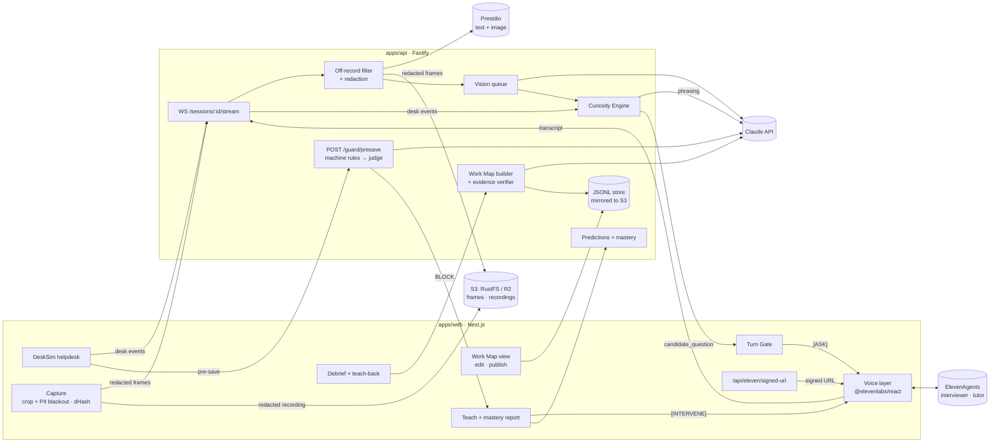

# Shadow

[](https://github.com/TanbirRamim/elevenlabs-agent/actions/workflows/ci.yml)

**Shadow learns why a senior support lead makes each decision, and stops a new hire from making the wrong one before it is saved.**

Hack-Nation × ElevenLabs, Challenge 01 "The AI Apprentice" ([brief](docs/challenge-brief.pdf)).

- Live app: https://shadow-web-meow-4acb.vercel.app (the API runs from a laptop during demos, see [deploying](docs/DEPLOY.md))
- 90-second replay: [/demo](https://shadow-web-meow-4acb.vercel.app/demo)
- Sample Work Map: [/map/latest?fixture=1](https://shadow-web-meow-4acb.vercel.app/map/latest?fixture=1)
- Requirement-by-requirement proof: [docs/EVIDENCE.md](docs/EVIDENCE.md)

## Capture → Map → Teach

| 1. Capture | 2. Map | 3. Teach |
| --- | --- | --- |
| The expert works tickets in a sandbox helpdesk (DeskSim). A voice agent watches the shared tab and stays quiet. At a real pause it asks one short question about the ticket on screen. | When the task ends, Claude drafts a Work Map from the session. A deterministic verifier checks every quote and frame. A spoken debrief asks what is still open, including cases the expert never showed. The expert confirms or corrects a teach-back, then edits and publishes the map. | A voice tutor watches a new hire work unseen tickets. At judgment points it asks them to predict the decision. Every save goes through a guard first. A save that breaks a guardrail is paused and explained with the expert's own words and screen clip. |
| **Why:** a recording shows *what* happened. A question at the right moment captures *why*. | **Why:** every step and guardrail cites a screen moment and a verbatim quote. No evidence, no rule. | **Why:** the mistake is caught before it reaches the customer, not in a later review. |

## Watch it work (90 s)

[/demo](https://shadow-web-meow-4acb.vercel.app/demo) plays the whole story in four chapters. It is a replay, and it says so on screen. It is not hand-animated: the replay steps through a scripted session and asks a question only where the real Turn Gate (`decide()` in [`lib/turnGate.ts`](apps/web/src/lib/turnGate.ts)) opens. Tickets come from [`seed/tickets.json`](seed/tickets.json) and the expert's words from the sample Work Map ([`replay/script.ts`](apps/web/src/components/replay/script.ts), 17 tests in [`script.test.ts`](apps/web/src/components/replay/script.test.ts)).

## How Shadow answers the Apprentice Test

**1. When to ask.** A pure function decides when Shadow may speak: 1.5 s of silence, 3 s without typing, 2.5 s of a still screen, a candidate with priority at least 0.6, at most 5 questions per 10 minutes and 90 s apart. The model decides how to phrase a question, never when. Gate: [`turnGate.ts`](apps/web/src/lib/turnGate.ts) (7 tests in [`turnGate.test.ts`](apps/web/src/lib/turnGate.test.ts)), run every 250 ms by [`useTurnGate.ts`](apps/web/src/lib/gate/useTurnGate.ts); the [insight panel](apps/web/src/components/insight/InsightPanel.tsx) shows why the gate is closed.

**2. What to ask.** Every decision opens gaps: guardrail, reason, exception, and an escalation contact for handoffs. Each gap scores `slotWeight × surprise × (1 − screenAnswerable) × recency`, so a question the screen already answers scores 0. Decayed gaps go to the debrief, with probes for fraud, legal and engineering cases the expert never showed. See [`ledger.ts`](apps/api/src/curiosity/ledger.ts), [`engine.ts`](apps/api/src/curiosity/engine.ts), [`probes.ts`](apps/api/src/curiosity/probes.ts) (13 tests).

**3. When it has understood.** The debrief stops when coverage is at least 0.9, no open question has priority 0.7 or more, and at least three questions were answered (hard cap: 8). Each answer rebuilds and re-verifies the map. Shadow then reads back a teach-back; the expert confirms or corrects it (at most two rounds). Last, Shadow predicts two variant cases derived from the map's rules. API: [`routes/debrief.ts`](apps/api/src/routes/debrief.ts) (8 tests); browser state machine: [`debrief/machine.ts`](apps/web/src/components/debrief/machine.ts) (20 tests).

**4. Whether the new hire learned.** The new hire works tickets Shadow never saw the expert handle. Predictions and guard verdicts are recorded per session. The mastery report is computed from them, not stored: each step or guardrail is independent, assisted or missed, with what to practise next. See [`mastery/compute.ts`](apps/api/src/mastery/compute.ts) (9 tests, including the scripted N1/N2 session) and [`MasteryReport.tsx`](apps/web/src/components/tutor/MasteryReport.tsx).

**5. Trust.** Off the record by button, `Alt+O` or voice; nothing from that span is stored. The transcript and screen frames are redacted with Presidio before they are stored and before Claude sees them. The expert can delete any step or guardrail before publishing. Details below.

## Trust and privacy

What the code does:

- **Off the record** by button, `Alt+O`, or saying "off the record" / "back on the record" ([`CaptureSession.tsx`](apps/web/src/app/capture/CaptureSession.tsx), [`helpers.ts`](apps/web/src/components/session/helpers.ts)). The browser pauses the frame loop and the recorder and stops sending transcript, desk events and screen context. The API also drops anything timed inside an off-record span ([`offRecord.ts`](apps/api/src/privacy/offRecord.ts), [`sessions.ts`](apps/api/src/routes/sessions.ts)). The voice call stays open so the agent can hear "back on the record"; its prompt tells it to stay silent.
- **Presidio before storage and before Claude.** Transcript segments go through the Presidio analyzer and anonymizer before they are stored. If Presidio is down, a placeholder is stored, never the raw text ([`presidio.ts`](apps/api/src/privacy/presidio.ts), [`transcript.ts`](apps/api/src/privacy/transcript.ts)). Frames go through the Presidio image redactor before storage and before vision ([`frames.ts`](apps/api/src/pipeline/frames.ts)). The Work Map builder and teach-back only read the stored, redacted transcript.
- **The recording is made from the redacted canvas, never the raw tab.** The browser crops to the helpdesk and blacks out every `[data-pii]` field before a frame or the recording sees it ([`redactedStream.ts`](apps/web/src/lib/capture/redactedStream.ts)).
- **Frames that cannot be redacted are dropped.** Not stored, not shown to a model (test "drops the frame when redaction fails: nothing stored, no vision" in [`frames.test.ts`](apps/api/src/pipeline/frames.test.ts)).
- **Unverifiable content becomes an open question.** The evidence verifier checks that every quote is a verbatim substring of an expert segment, every frame was stored, nothing cites off-the-record time, and every machine-rule phrase appears in its quote. What fails after one repair pass is removed and asked in the debrief instead ([`verify.ts`](apps/api/src/workmap/verify.ts), [`build.ts`](apps/api/src/workmap/build.ts)).
- **Call audio is not stored** by either voice agent (`record_voice: false`; only the transcript is retained), per the live configuration in [`agents/README.md`](agents/README.md).
- **Customer PII stays out of the judge prompt.** The guard judge receives the case (plan, VIP flag, account age, ticket, action), not the customer's name or email (test "sends the judge the case, not the customer's name or email" in [`judge.test.ts`](apps/api/src/llm/judge.test.ts)).
- **Keys stay on servers.** The ElevenLabs API key signs a short-lived conversation URL in [`signed-url/route.ts`](apps/web/src/app/api/eleven/signed-url/route.ts) and never reaches the browser. A secret scan runs in the pre-commit hook and in CI.

Live speech goes to the ElevenLabs agent, as in any voice call. Presidio redaction covers the transcript and frames Shadow stores and every Claude call built from them. The guard judge sees ticket content, but not the customer's name or email.

## Engineering

Measured on `main` at commit `9897f32` on 2026-10-04:

| Check | Result |
| --- | --- |
| Unit tests (`pnpm verify`: lint, typecheck, test) | **414 passing, 1 skipped** in 55 files: web 244 (32 files), api 158 + 1 skipped (21), guard 7 (1), schema 5 (1). The skipped test calls live Claude and runs only with `ANTHROPIC_API_KEY`. |
| End-to-end (`pnpm --filter @shadow/web exec playwright test`) | **16 tests**, real API in fixture mode, voice stubbed. Run 1: 15 passed, 1 failed (`demo: keyboard controls ...`, a button not found within 15 s). Immediate re-run: 16/16 passed. |
| Guard eval (`pnpm eval:guard`, reference guardrails) | **9/9** naive wrong actions caught, **0/16** false blocks on expert outcomes |
| Tutor eval (`pnpm eval:tutor seed/fixtures/workmap.json`, judge off: no key in this environment) | N1 caught, **0/12** false blocks, **5/7** caught overall, held-out **3/5** (target 80 %, so the command exits 1). Both misses are cases the sample map has no guardrail for; see [EVIDENCE](docs/EVIDENCE.md#tutor-eval-on-the-sample-map). |
| CI ([`ci.yml`](.github/workflows/ci.yml)) | 3 jobs: `verify` (secret scan, lint, typecheck, tests, guard eval, build), `cloudflare-build`, `ownership` (PRs only) |
| Merged pull requests | 39 |

- **Contracts.** Every shape that crosses a boundary is a Zod schema in [`packages/schema`](packages/schema/src/index.ts), shared by web and API. WebSocket messages are validated on both ends ([`protocol.ts`](packages/schema/src/protocol.ts)); the web client validates every request and response ([`api.ts`](apps/web/src/lib/api.ts)).
- **Ownership CI.** [`ownership.json`](ownership.json) maps every path to an owner; [`check-ownership.mjs`](scripts/check-ownership.mjs) fails a PR that edits another owner's files without a `shared-change` label.
- **Guard eval in CI.** `pnpm eval:guard` runs on every PR and fails below 90 % catch rate or on any false block.
- **Tutor eval.** [`eval/tutor.mts`](eval/tutor.mts) runs the real pre-save guard (machine rules, then the judge when a key is set) over N1, N2 and H1–H10 for any captured map.

## Architecture



One capture session and one teach session, step by step: [docs/ARCHITECTURE.md](docs/ARCHITECTURE.md).

## Built with ElevenLabs

What the code and the recorded agent configuration use:

- **ElevenAgents, two roles**, both on Claude Sonnet 5.5 inside ElevenAgents: an interviewer for capture and debrief ([`agents/interviewer.md`](agents/interviewer.md)) and a tutor for teach ([`agents/tutor.md`](agents/tutor.md)). Speech recognition is Scribe v2 Realtime with the Turn V3 turn model ([`agents/README.md`](agents/README.md)).
- **Signed URLs.** The server calls `GET /v1/convai/conversation/get-signed-url`; agent authentication is on ([`signed-url/route.ts`](apps/web/src/app/api/eleven/signed-url/route.ts)). On 2026-10-04 the deployed route returned a signed URL for both agents.
- **`skip_turn`**: both prompts stay silent unless the app sends a control message.
- **Hidden control messages** via `sendUserMessage`: `[ASK]`, `[DEBRIEF]`, `[TEACHBACK]`, `[PREDICT]`, `[INTERVENE]` ([`protocol.ts`](apps/web/src/lib/voice/protocol.ts)).
- **`sendContextualUpdate`** for screen context such as `[SCREEN 03:12] ...`, coalesced to one update per 2 s ([`coalesce.ts`](apps/web/src/lib/voice/coalesce.ts)). It never triggers a reply.
- **`sendUserActivity`** on every helpdesk keystroke or click, so the agent holds its turn while the expert types.
- **`vad_score` client events** feed the Turn Gate's "is the expert speaking" signal ([`useVoice.ts`](apps/web/src/lib/voice/useVoice.ts)).
- **Client tool `replay_clip(frameId)`**: the tutor plays the expert's clip on the learner's screen ([`TeachSession.tsx`](apps/web/src/app/teach/TeachSession.tsx)).
- **Knowledge base source**: `GET /workmaps/:id/markdown` renders the published map for the tutor. Uploading it is a dashboard step.

## Built with Claude

Every Claude call goes through one function, [`llm/structured.ts`](apps/api/src/llm/structured.ts): a versioned prompt route from [`packages/prompts`](packages/prompts/src/index.ts), a Zod output schema passed as a structured output format, server-side fallback, and a typed `LlmError` on refusal, `max_tokens` or unparseable output. The model comes from `SHADOW_MODEL` (default `claude-opus-5-5`). Effort is set per route:

| Route | Effort | Used for |
| --- | --- | --- |
| `vision@2` | low | What changed on a redacted frame, and what the screen already answers ([`vision.ts`](apps/api/src/llm/vision.ts)) |
| `curiosity@1` | low | Phrasing the top-ranked gap as one short question ([`engine.ts`](apps/api/src/curiosity/engine.ts)) |
| `workmap@1` | high | Drafting the Work Map from events, transcript and answers; then verify, one repair pass, and open questions for what still fails ([`build.ts`](apps/api/src/workmap/build.ts)) |
| `teachback@1` | medium | The spoken teach-back and the one-sentence re-check after a correction ([`debrief.ts`](apps/api/src/routes/debrief.ts)) |
| `judge@1` | low | Second opinion on a risky save against the published map's guardrails. It can only make a verdict stricter, must cite an existing guardrail id, and times out to an explicit, visible allow after 2.5 s ([`judge.ts`](apps/api/src/llm/judge.ts), 12 tests plus 1 live test that needs a key) |

## Run it

**Mock mode** (no keys, no Docker). Claude and Presidio are replaced by [seed fixtures](seed/fixtures); the guard uses [`seed/reference-guardrails.json`](seed/reference-guardrails.json). This is the configuration the Playwright suite runs against.

```bash
pnpm install --frozen-lockfile
pnpm exec turbo run build --filter=@shadow/web^... --filter=@shadow/api^...
MOCK_AI=1 DEMO_FALLBACK_RULES=1 pnpm --filter @shadow/api dev   # terminal 1, :4000
pnpm --filter @shadow/web dev                                    # terminal 2, :3000
```

Open http://localhost:3000. Capture (without voice), the debrief with typed answers, the Work Map and the teach intercept on ticket N1 run on fixtures. Voice needs the ElevenLabs variables below.

**Full mode** (Node 22, pnpm 12, Docker):

```bash
cp .env.example .env      # ElevenLabs key + two agent ids, Anthropic key
pnpm infra:up             # Presidio analyzer, anonymizer, image redactor; RustFS (S3)
pnpm dev                  # web on :3000, API on :4000
pnpm verify               # lint, typecheck, unit tests
pnpm eval:guard           # guardrail catch-rate eval
pnpm eval:tutor published # captured-map eval against the running API
```

Without `ANTHROPIC_API_KEY` the debrief routes answer `503 llm_unavailable`, frames are stored redacted but never shown to a model, and the guard uses machine rules only.

## Moonshot: people first, then agents

The Work Map that taught the new hire can run as an agent policy. `GET /workmaps/:id/export?format=agent` turns it into a system prompt plus machine rules. [`/copilot`](https://shadow-web-meow-4acb.vercel.app/copilot) runs that policy in shadow mode over the 10 held-out tickets with the same guard as the teach page, and hands blocks, approvals, stop-and-ask rules and judgment calls to a human. Safety policy: it never takes an irreversible money action alone, so a refund with no rule clearing it goes to a person ([`routes/export.ts`](apps/api/src/routes/export.ts), 8 tests; [`CopilotView.tsx`](apps/web/src/components/copilot/CopilotView.tsx)). On the sample map without a key it agrees with the answer key on 6 of 10 tickets, hands 6 to a human and makes 1 unsafe auto-action, against 5 for the default action without the map. The order is the point: the agent learns from a person, and people learn first.

## Repository

```
apps/web          Next.js: capture, debrief, Work Map, teach, copilot, /demo replay, DeskSim
apps/api          Fastify: session WebSocket, redaction, vision, Curiosity Engine,
                  Work Map builder + verifier, debrief, guard + judge, mastery, export, JSONL store
apps/edge         Optional Cloudflare Workers + Containers config
packages/schema   Zod contracts shared by web and API
packages/guard    Deterministic guardrail engine + eval
packages/prompts  Versioned prompts with per-route effort
agents/           ElevenAgents prompts and live configuration
eval/             Captured-map tutor eval
seed/             Demo tickets, reference guardrails and fixtures (fake data)
```

Docs: [evidence](docs/EVIDENCE.md) · [architecture](docs/ARCHITECTURE.md) · [product plan](docs/PRODUCT_PLAN.md) · [implementation plan](docs/IMPLEMENTATION_PLAN.md) · [design system](docs/DESIGN.md) · [demo walkthrough](docs/demo-script.md) · [deploying](docs/DEPLOY.md) · [contributing](CONTRIBUTING.md) · [rules for AI coding assistants](AGENTS.md)

## Team

- **Tanbir Ramim** ([@TanbirRamim](https://github.com/TanbirRamim)): voice agents, capture, debrief, Work Map, teach, replay, design
- **Harshit**: DeskSim helpdesk, API, privacy pipeline, Curiosity Engine, Work Map builder, guard and judge, mastery, copilot export
