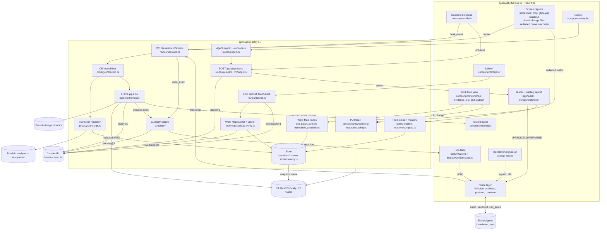
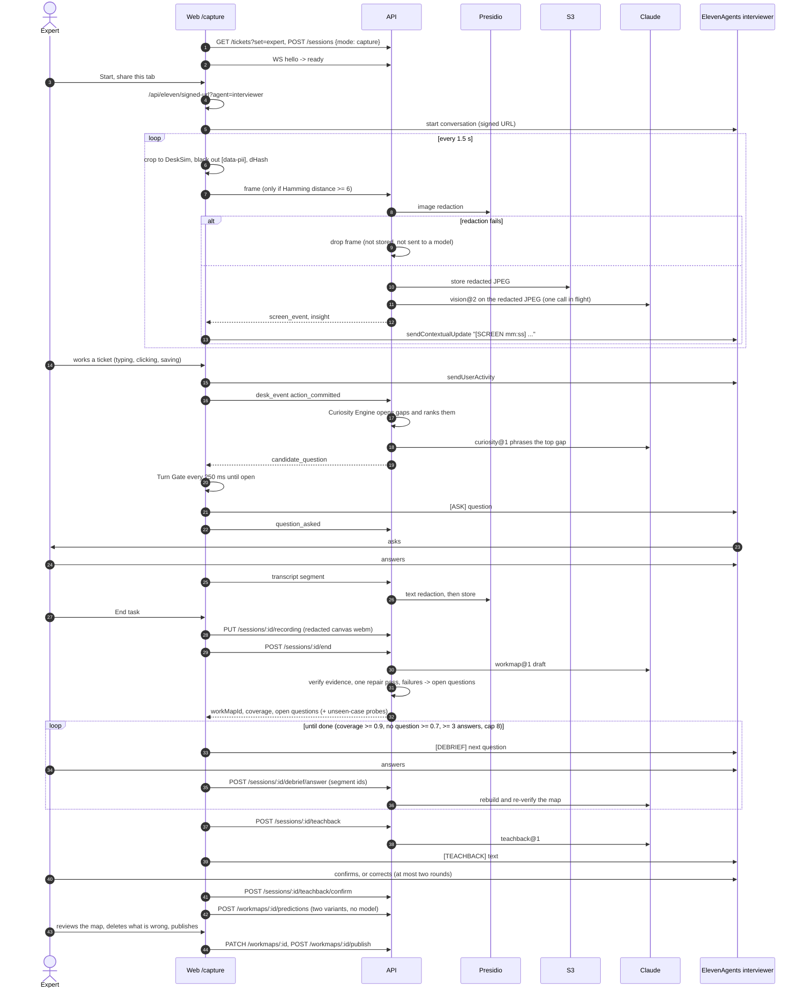
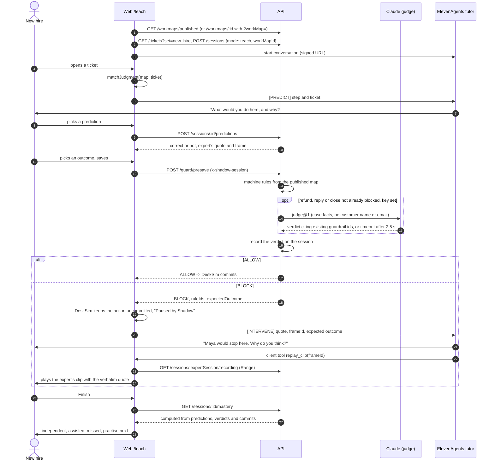

# Architecture

Shadow is a TypeScript monorepo: a Next.js web app, a Fastify API, and shared packages. This page shows what runs where, then follows one capture session and one teach session through the code. It describes `main` at commit `9897f32` (2026-10-04).

For the plan and the reasons behind each decision, see [IMPLEMENTATION_PLAN §3](IMPLEMENTATION_PLAN.md). For requirement status, see [EVIDENCE.md](EVIDENCE.md).

## Components

Notes:

- Every Claude call goes through [`llm/structured.ts`](../apps/api/src/llm/structured.ts): a versioned route from [`packages/prompts`](../packages/prompts/src/index.ts), a Zod output schema, server-side fallback, and a typed `LlmError` on refusal, `max_tokens` or unparseable output. Effort is per route: vision, curiosity and the judge run low, teach-back medium, the Work Map builder high.
- WebSocket messages are Zod-validated on both ends ([`protocol.ts`](../packages/schema/src/protocol.ts), [`lib/stream.ts`](../apps/web/src/lib/stream.ts)).
- The guard is one function, `runGuard` in [`llm/judge.ts`](../apps/api/src/llm/judge.ts), shared by `/guard/presave`, `/copilot/run` and `pnpm eval:tutor`. Machine rules from the published map run first ([`packages/guard`](../packages/guard/src/index.ts)). For a refund, reply or close they did not block, the judge checks the action against all of the map's guardrails. The judge can only make a verdict stricter and must cite an existing guardrail. When no map is published, the guard uses [`seed/reference-guardrails.json`](../seed/reference-guardrails.json) only if `DEMO_FALLBACK_RULES=1`, and never calls the judge.
- Persistence: the in-memory store is flushed every second as JSONL snapshots under `infra/data/state`, mirrored to S3/R2 when configured, and replayed on boot ([`store/jsonl.ts`](../apps/api/src/store/jsonl.ts), wired in [`main.ts`](../apps/api/src/main.ts)). Postgres runs in [`infra/docker-compose.yml`](../infra/docker-compose.yml) but no code uses it.
- Without `ANTHROPIC_API_KEY`: frames are stored redacted but not sent to vision, the Curiosity Engine is not started, the debrief routes answer `503 llm_unavailable`, and the guard uses machine rules only ([`app.ts`](../apps/api/src/app.ts)).
- `MOCK_AI=1` replaces Claude and Presidio with [seed fixtures](../seed/fixtures): a fixture question 3 s after each committed action, fixture debrief and teach-back, the sample map behind the real Work Map, teach and export routes. No frames are stored. The Playwright suite runs in this mode.

## One capture session

Code for each step:

| Step | Code |
| --- | --- |
| Session and stream | [`CaptureSession.tsx`](../apps/web/src/app/capture/CaptureSession.tsx), [`lib/stream.ts`](../apps/web/src/lib/stream.ts), [`routes/sessions.ts`](../apps/api/src/routes/sessions.ts) |
| Frame capture and change filter | [`frameLoop.ts`](../apps/web/src/lib/capture/frameLoop.ts), [`dhash.ts`](../apps/web/src/lib/capture/dhash.ts), [`snapshot.ts`](../apps/web/src/lib/capture/snapshot.ts) |
| Redacted recording | [`redactedStream.ts`](../apps/web/src/lib/capture/redactedStream.ts), [`recorder.ts`](../apps/web/src/lib/capture/recorder.ts), [`routes/recording.ts`](../apps/api/src/routes/recording.ts) |
| Frame redaction, storage, vision | [`frames.ts`](../apps/api/src/pipeline/frames.ts), [`presidioImage.ts`](../apps/api/src/privacy/presidioImage.ts), [`vision.ts`](../apps/api/src/llm/vision.ts) |
| Insight numbers | [`metrics.ts`](../apps/api/src/pipeline/metrics.ts), [`InsightPanel.tsx`](../apps/web/src/components/insight/InsightPanel.tsx) |
| Gaps, priority, phrasing, probes | [`ledger.ts`](../apps/api/src/curiosity/ledger.ts), [`engine.ts`](../apps/api/src/curiosity/engine.ts), [`probes.ts`](../apps/api/src/curiosity/probes.ts) |
| When to speak | [`turnGate.ts`](../apps/web/src/lib/turnGate.ts), [`useTurnGate.ts`](../apps/web/src/lib/gate/useTurnGate.ts) |
| Voice | [`useVoice.ts`](../apps/web/src/lib/voice/useVoice.ts), [`protocol.ts`](../apps/web/src/lib/voice/protocol.ts), [`agents/interviewer.md`](../agents/interviewer.md) |
| Transcript redaction and spoken off-record | [`transcript.ts`](../apps/api/src/privacy/transcript.ts), [`presidio.ts`](../apps/api/src/privacy/presidio.ts), [`offRecord.ts`](../apps/api/src/privacy/offRecord.ts) |
| Map build and verification | [`build.ts`](../apps/api/src/workmap/build.ts), [`verify.ts`](../apps/api/src/workmap/verify.ts), [`normalize.ts`](../apps/api/src/workmap/normalize.ts) |
| Debrief, teach-back, predictions | [`routes/debrief.ts`](../apps/api/src/routes/debrief.ts), [`predictions.ts`](../apps/api/src/workmap/predictions.ts), [`debrief/machine.ts`](../apps/web/src/components/debrief/machine.ts), [`debrief/useDebrief.ts`](../apps/web/src/components/debrief/useDebrief.ts) |
| Edit and publish | [`routes/workmaps.ts`](../apps/api/src/routes/workmaps.ts), [`WorkMapView.tsx`](../apps/web/src/components/workmap/WorkMapView.tsx) |

Off the record at any point: the browser pauses the frame loop and the recorder and stops sending transcript, desk events and screen context. The API drops any message timed inside an off-record span. The agent's prompt tells it to say "Okay, off the record" and stay silent. During capture the guard is consulted but never blocks: the expert's action always goes through.

## One teach session

| Step | Code |
| --- | --- |
| Session, map loading, guard call, intervention | [`TeachSession.tsx`](../apps/web/src/app/teach/TeachSession.tsx) |
| Judgment points, intervention payload, clip lookup | [`tutor/logic.ts`](../apps/web/src/components/tutor/logic.ts) |
| Save interception | [`DeskSim.tsx`](../apps/web/src/components/desk/DeskSim.tsx) |
| Guard and judge | [`routes/guard.ts`](../apps/api/src/routes/guard.ts), [`llm/judge.ts`](../apps/api/src/llm/judge.ts), [`packages/guard`](../packages/guard/src/index.ts) |
| Predictions and mastery | [`routes/teach.ts`](../apps/api/src/routes/teach.ts), [`mastery/compute.ts`](../apps/api/src/mastery/compute.ts) |
| Panels | [`InterventionPanel.tsx`](../apps/web/src/components/tutor/InterventionPanel.tsx), [`PredictPanel.tsx`](../apps/web/src/components/tutor/PredictPanel.tsx), [`ClipOverlay.tsx`](../apps/web/src/components/tutor/ClipOverlay.tsx), [`MasteryReport.tsx`](../apps/web/src/components/tutor/MasteryReport.tsx) |
| Tutor prompt | [`agents/tutor.md`](../agents/tutor.md) |

If the judge times out, the API returns an explicit `timeout_allow` verdict and the page shows a warning. If the API does not answer within 6 s, the page allows the save and says it was not checked. Neither case is silent.

## Deployment

Web on Cloudflare Workers (OpenNext) at <https://shadow-web.tanbirramim420.workers.dev>. API and Presidio in one Docker image on Render's free web service. Details and the alternatives: [DEPLOY.md](DEPLOY.md), [DEPLOY_CLOUDFLARE.md](DEPLOY_CLOUDFLARE.md).
