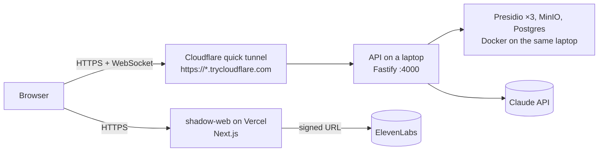

# Deploying Shadow (free setup)

Nothing in this setup costs money. The web app runs on Vercel's Hobby plan; the API and Presidio run on one of our laptops in Docker and get a public HTTPS URL through a free Cloudflare quick tunnel. The paid, fully hosted alternative (Cloudflare Workers + Containers) is in `docs/DEPLOY_CLOUDFLARE.md` and needs the Workers Paid plan.



| Piece | Where | Cost |
| --- | --- | --- |
| Web | Vercel Hobby, project root `apps/web`, auto-deploys from `main` | free |
| API + Presidio + storage | `pnpm api:public` on the demo laptop | free |
| Public URL for the API | Cloudflare quick tunnel (no account needed) | free |

**Trade-off:** the API only works while that laptop is on, online and running `pnpm api:public`. The tunnel URL changes every time the command restarts, so the web app's `NEXT_PUBLIC_API_*` variables must be updated and redeployed after each restart (about 2 minutes). Start the tunnel well before a demo and leave it running.

## 1. API on the laptop

One-time: Docker Desktop, `.env` filled in (at least `ANTHROPIC_API_KEY`), and `cloudflared` installed (macOS: `brew install cloudflared`; other platforms: [Cloudflare's install page](https://developers.cloudflare.com/cloudflare-one/connections/connect-apps/install-and-setup/installation/)).

```bash
pnpm api:public --web https://<your-vercel-url>.vercel.app
```

The script starts Presidio, MinIO and Postgres in Docker, runs the API on `:4000`, opens the tunnel and prints:

```
Public API URL: https://<random-words>.trycloudflare.com
  NEXT_PUBLIC_API_URL=https://<random-words>.trycloudflare.com
  NEXT_PUBLIC_API_WS_URL=wss://<random-words>.trycloudflare.com
```

`--web` adds the Vercel origin to CORS (`WEB_ORIGIN` accepts a comma-separated list). Check it works: `curl https://<random-words>.trycloudflare.com/health`.

## 2. Web on Vercel

Vercel → Add New → Project → import `TanbirRamim/elevenlabs-agent`.

| Setting | Value |
| --- | --- |
| Root Directory | `apps/web` |
| Framework | Next.js (auto-detected) |
| Build command | from `apps/web/vercel.json` (builds the shared packages first); leave the default |
| Node.js version | 22.x (Settings → General) |

Environment variables (Settings → Environment Variables, all environments unless noted):

| Name | Value | Why |
| --- | --- | --- |
| `ENABLE_EXPERIMENTAL_COREPACK` | `1` | makes Vercel use pnpm 12 from `package.json`; its built-in pnpm stops at 10 |
| `NEXT_PUBLIC_API_URL` | `https://<random-words>.trycloudflare.com` | from step 1; baked in at build time |
| `NEXT_PUBLIC_API_WS_URL` | `wss://<random-words>.trycloudflare.com` | from step 1 |
| `ELEVENLABS_API_KEY` | secret | signed URLs for the voice agents |
| `ELEVENLABS_INTERVIEWER_AGENT_ID` | from the ElevenLabs dashboard | |
| `ELEVENLABS_TUTOR_AGENT_ID` | from the ElevenLabs dashboard | |

Deploy. After every tunnel restart: update the two `NEXT_PUBLIC_API_*` values and click **Redeploy** on the latest deployment.

## 3. Checks

- `https://<tunnel>/health` → `{"ok":true,...}`
- Open the Vercel URL, allow microphone and screen sharing, run Capture → Map → Teach once.

## Day-of-demo checklist

- [ ] `pnpm api:public --web <vercel url>` running on the demo laptop (not on battery saver)
- [ ] Vercel `NEXT_PUBLIC_API_*` match the tunnel URL printed today; redeployed
- [ ] Phone hotspot ready in case the venue network blocks the tunnel
