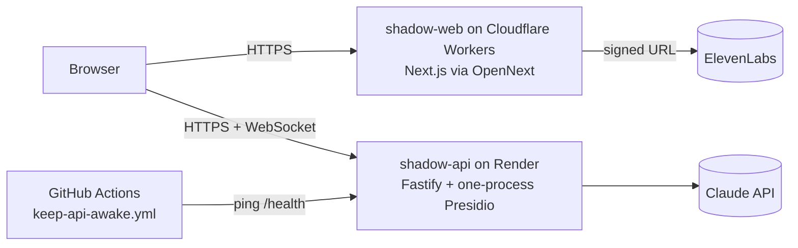

# Deploying Singoda AI (free setup)

The live deployment uses two free services: the web app runs on **Cloudflare Workers** (OpenNext adapter) and the API, with Presidio, runs on **Render's free Docker web service**. Vercel is retired. Repository, package and service names still say `shadow`.



| Piece | Where | Cost |
| --- | --- | --- |
| Web | Cloudflare Worker `shadow-web`, auto-deployed from `main` by Workers Builds: **https://shadow-web.tanbirramim420.workers.dev** | free |
| API + Presidio | Render web service `shadow-api` from [`render.yaml`](../render.yaml): **https://shadow-api-8hvl.onrender.com** | free |
| Keep-alive | [`keep-api-awake.yml`](../.github/workflows/keep-api-awake.yml) pings `/health` every 10 minutes so the free instance does not sleep | free |
| Production smoke | [`prod-smoke.yml`](../.github/workflows/prod-smoke.yml) runs `pnpm smoke:prod` against the live web app every 30 minutes | free |

**Trade-offs:** Render's free tier sleeps after 15 minutes without traffic; the keep-alive workflow prevents that, and without it the first request waits for a cold start. The Render disk is ephemeral: frames and recordings are reset on every restart or deploy unless `S3_*` points at durable storage. The published Work Map comes back from `seed/boot`.

## 1. API on Render

Details of the image and how it fits in 512 MB: [DEPLOY_RENDER.md](DEPLOY_RENDER.md). Create the service from the Blueprint (`render.yaml`), then set these environment variables in the Render dashboard (the full list is in [`apps/api/src/env.ts`](../apps/api/src/env.ts) and [`.env.example`](../.env.example)):

| Name | Value | Why |
| --- | --- | --- |
| `ANTHROPIC_API_KEY` | secret | vision, questions, Work Map, teach-back, guard judge |
| `WEB_ORIGIN` | both web origins, comma-separated, starting with `https://shadow-web.tanbirramim420.workers.dev` | CORS for the browser |
| `CAPTURE_SIGNALS` | `vision+desk` | use helpdesk events alongside vision |
| `FRAME_REDACTION` | `browser` | frames arrive already redacted by the browser crop and `[data-pii]` blackout |
| `DEMO_FALLBACK_RULES` | `0` | from `render.yaml` |
| `GUARD_JUDGE_TIMEOUT_MS` | `6000` | from `render.yaml` |

Check: `curl https://shadow-api-8hvl.onrender.com/health` returns `{"ok":true,...}`.

## 2. Web on Cloudflare Workers

The Worker is configured in [`apps/web/wrangler.jsonc`](../apps/web/wrangler.jsonc) and [`apps/web/open-next.config.ts`](../apps/web/open-next.config.ts). Workers Builds deploys every push to `main` with:

| Setting | Value |
| --- | --- |
| Build command | `pnpm install --frozen-lockfile && pnpm cf:build:web` |
| Deploy command | `cd apps/web && npx opennextjs-cloudflare deploy` |
| Build variables | `NEXT_PUBLIC_API_URL=https://shadow-api-8hvl.onrender.com`, `NEXT_PUBLIC_API_WS_URL=wss://shadow-api-8hvl.onrender.com` (inlined at build time, see [`apps/web/src/env.ts`](../apps/web/src/env.ts)) |

The ElevenLabs credentials are Worker secrets, never build variables, so the key stays server-side:

```bash
cd apps/web
npx wrangler secret put ELEVENLABS_API_KEY
npx wrangler secret put ELEVENLABS_INTERVIEWER_AGENT_ID
npx wrangler secret put ELEVENLABS_TUTOR_AGENT_ID
```

To deploy by hand from a clone: `pnpm install --frozen-lockfile && pnpm cf:build:web`, then `cd apps/web && npx opennextjs-cloudflare deploy`.

## 3. Checks

```bash
SMOKE_WEB_URL=https://shadow-web.tanbirramim420.workers.dev pnpm smoke:prod
node scripts/smoke-real.mjs --api https://shadow-api-8hvl.onrender.com
```

On 2026-10-04 the production smoke passed 13/13 and the live Claude pipeline passed every step ([EVIDENCE](EVIDENCE.md#verified-live-2026-10-04)).

## Alternatives

- Laptop API behind a Cloudflare quick tunnel: `pnpm api:public --web <web url>` (no account; the tunnel URL changes on every restart).
- Fully hosted on Cloudflare Workers + Containers (Workers Paid plan): [DEPLOY_CLOUDFLARE.md](DEPLOY_CLOUDFLARE.md).
- Hugging Face Docker Space (now paid): [DEPLOY_SPACE.md](DEPLOY_SPACE.md).
