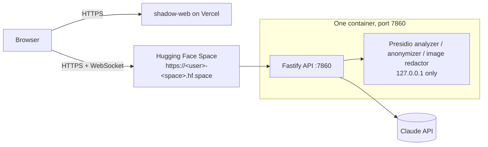

# Deploying the API to a Hugging Face Space (free, always on)

The laptop and Cloudflare quick tunnel setup in `docs/DEPLOY.md` stops working whenever the laptop sleeps. This guide moves the whole backend (the API plus Presidio) into **one Docker image** on a free Hugging Face Space. The web app stays on Vercel.



| | |
| --- | --- |
| Cost | free (CPU basic: 2 vCPU, 16 GB RAM) |
| Files | `infra/space/Dockerfile`, `infra/space/start.sh` (process runner), `infra/space/README.md` (Space card), `infra/space/deploy.sh` (bundle + push), `infra/space/smoke.mjs` (check) |
| Public port | 7860 (the API). Presidio listens on 127.0.0.1 and is never reachable from outside. |
| Storage | the container disk is wiped on every restart; see [Optional: durable storage](#optional-durable-storage) |

## Measured locally

Measured on the founder's Mac (Docker Desktop, arm64). Hugging Face builds and runs on amd64, so expect numbers in the same range, not identical.

| | |
| --- | --- |
| Image size | 2.6 GB unpacked (about 0.8 GB compressed) |
| Image build | about 3.5 min |
| Cold start, real mode (container start → `/health` 200) | 18 s with a warm disk cache (also with `--cpus 2`); 45–66 s on a cold disk (66 s with `--cpus 2` while another build was running). Almost all of it is Presidio loading the spaCy `en_core_web_lg` model (analyzer and image redactor each load it). Hugging Face adds the time to pull the image onto a machine. |
| Cold start, `MOCK_AI=1` | under 7 s (Presidio is not started in fixture mode) |
| Memory, real mode, idle | about 1.7 GB of the 16 GB |
| Memory, `MOCK_AI=1` | about 120 MB |

Checked with the built image: `/health` 200, the session WebSocket (`hello` → `ready`), a transcript segment containing a name, an email and a phone number stored as `<PERSON> at <EMAIL_ADDRESS> or call <PHONE_NUMBER> about the refund.`, the image redactor blanking text in a test JPEG, and the container exiting (so the Space restarts it) when a Presidio process dies.

## 1. Create the Space (one time, about 5 minutes)

1. Sign up or log in at <https://huggingface.co>.
2. Create a write token: avatar (top right) → **Settings** → **Access Tokens** → **Create new token** → token type **Write** → name it `shadow-deploy` → **Create token**. Copy it somewhere safe; you will paste it as the git password in step 2.
3. Create the Space: <https://huggingface.co/new-space>
   - **Owner**: your account. **Space name**: `shadow-api` (any name works; it becomes part of the URL).
   - **License**: leave empty or pick one.
   - **Select the Space SDK**: **Docker** → template **Blank**.
   - **Space hardware**: **CPU basic · 2 vCPU · 16 GB · FREE**.
   - Visibility: **Public**. (A private Space needs a Hugging Face token on every request, which the browser does not have.)
   - Click **Create Space**.
4. Add the settings: on the Space page → **Settings** → **Variables and secrets**.

   Under **Secrets** (**New secret**; values are hidden), add by name:

   | Name | Value |
   | --- | --- |
   | `ANTHROPIC_API_KEY` | the Anthropic key (the same one as in the laptop `.env`) |

   Under **Variables** (**New variable**; values are visible), add:

   | Name | Value |
   | --- | --- |
   | `WEB_ORIGIN` | `https://shadow-web-meow-4acb.vercel.app` |
   | `DEMO_FALLBACK_RULES` | `0` |
   | `SHADOW_MODEL` | only if you want a model other than the default `claude-opus-5-5` |

   Not needed on the Space: `ELEVENLABS_*` (only the Vercel app uses them), `DATABASE_URL` (unused), `API_PORT` and `PRESIDIO_*` (set inside the image). Never set `MOCK_AI=1` here; it serves fixture data instead of the real pipeline.

## 2. Push the code (every time you want to update the API)

From an up-to-date checkout of `main` on the laptop:

```bash
git switch main && git pull
bash infra/space/deploy.sh --push <your-hf-username>/shadow-api
```

When git asks: **Username** = your Hugging Face username, **Password** = the write token from step 1.2.

The script copies only what the image needs (the API, shared packages, seed data and the Dockerfile, all text files) from the last commit into a temporary folder and force-pushes that to the Space. Uncommitted changes and `.env` are never included. The Space's own git history is not kept; every deploy replaces it.

Hugging Face then builds the image (watch it on the Space page → **Logs** → **Build**; expect 5–10 minutes) and starts it. The status badge next to the Space name goes **Building** → **Running**. In **Logs** → **Container** you should see:

```
[space] presidio ready after …s
[space] API starting on 0.0.0.0:7860
… "Server listening at http://…:7860"
```

Web upload instead of git: run `bash infra/space/deploy.sh` (without `--push`). It prints a folder path. On the Space page → **Files** → **+ Contribute** → **Upload files**, drag in everything inside that folder, keeping the folder structure, and commit. The git push is less error-prone.

## 3. Find the Space URL and check it

The API URL is `https://<username>-<space-name>.hf.space`, all lowercase, with `.` and `_` turned into `-`. Example: user `TanbirRamim`, Space `shadow-api` → `https://tanbirramim-shadow-api.hf.space`. You can also copy it from the Space page → **⋮** (top right) → **Embed this Space** → **Direct URL**.

```bash
curl https://<username>-shadow-api.hf.space/health
# {"ok":true,"model":"claude-opus-5-5"}
node infra/space/smoke.mjs https://<username>-shadow-api.hf.space
# ... PASS (health, tickets, session, WebSocket hello -> ready, transcript accepted)
```

## 4. Point the web app at the Space

In Vercel → project `shadow-web` → **Settings** → **Environment Variables**, change (all environments):

| Name | New value |
| --- | --- |
| `NEXT_PUBLIC_API_URL` | `https://<username>-shadow-api.hf.space` |
| `NEXT_PUBLIC_API_WS_URL` | `wss://<username>-shadow-api.hf.space` |

Then **Deployments** → latest → **⋮** → **Redeploy**. These values are baked in at build time, so the redeploy is required. The founder's assistant can make this Vercel change. Unlike the quick tunnel, the Space URL never changes, so this is a one-time edit.

Finally open <https://shadow-web-meow-4acb.vercel.app> and run Capture → Map → Teach once.

## Sleep and cold starts

- Free Spaces go to sleep after a period without traffic (Hugging Face documents this as about **48 hours**; the setting is under **Settings** → **Sleep time**, and on free hardware it cannot be turned off). A sleeping Space wakes on the next visit to its page or URL.
- A wake-up is a full container start: Hugging Face starts the image, then Presidio loads (measured above at 18–66 s), then the API answers. The first judge request after a sleep can therefore take a minute or more, and an API request may fail with a gateway error while the Space shows **Starting**. Restarts after a push or a settings change behave the same.
- To avoid that before a demo or judging window: open `https://<username>-shadow-api.hf.space/health` yourself a few minutes earlier and wait for `{"ok":true,...}`.
- To keep it awake through a judging period, a free uptime monitor (for example UptimeRobot or a scheduled GitHub Action) can request `/health` once every few hours. Whether Hugging Face's terms allow keep-alive pings has not been verified; check before relying on it. With a 48-hour sleep window, one request a day is enough.

## What does not persist, and what fails closed

- **Sessions and Work Maps** live as JSONL on the container disk. They survive API restarts inside the container but are **lost when the Space restarts or wakes from sleep**, unless durable storage is configured below. Publish the Work Map in the same window as the demo, or configure storage.
- **Screen recordings** (upload and replay) need S3-compatible storage. Without it, those routes answer `503 storage_unavailable` and the rest of the app works.
- **Screen frames** are redacted by the bundled Presidio image redactor (tesseract OCR) before anything sees them. If redaction fails or times out, the frame is dropped, never stored or sent to Claude.
- **Transcripts** are redacted by Presidio before they are stored. During the first seconds of a cold start, or if Presidio is down, segments are stored as `[redaction unavailable]` instead of raw text. If Presidio has not answered after 240 s (`PRESIDIO_WAIT_SECONDS`), the API starts anyway with that fail-closed behaviour.

## Optional: durable storage

Any S3-compatible bucket works. Cloudflare R2's free tier (10 GB) is enough.

1. Cloudflare dashboard → **R2** → **Create bucket** → name `shadow-frames`.
2. **R2** → **Manage API tokens** → **Create API token**. The API calls `CreateBucket` at boot, so the token needs **Admin Read & Write**. With an object-only token the container log shows `s3 unreachable, storage disabled` and storage stays off. (I have not tested R2 against this image; that log line is how to tell.)
3. Add to the Space: Secrets `S3_ACCESS_KEY`, `S3_SECRET_KEY`; Variables `S3_ENDPOINT` = `https://<account-id>.r2.cloudflarestorage.com`, `S3_BUCKET` = `shadow-frames`.

With storage set, recordings work, redacted frames are kept, and sessions and maps are mirrored to the bucket and restored after a restart.

## Run the image locally

```bash
docker build -f infra/space/Dockerfile -t shadow-space .
docker run --rm -p 7861:7860 -e WEB_ORIGIN=http://localhost:3000 shadow-space   # real mode, no keys
docker run --rm -p 7861:7860 -e MOCK_AI=1 -e DEMO_FALLBACK_RULES=1 shadow-space  # fixture mode
node infra/space/smoke.mjs http://localhost:7861
```

Add `-e ANTHROPIC_API_KEY=...` (or `--env-file .env`, but then override the `PRESIDIO_*`, `S3_*` and `API_PORT` values, which point at the laptop setup) to run the full pipeline.
