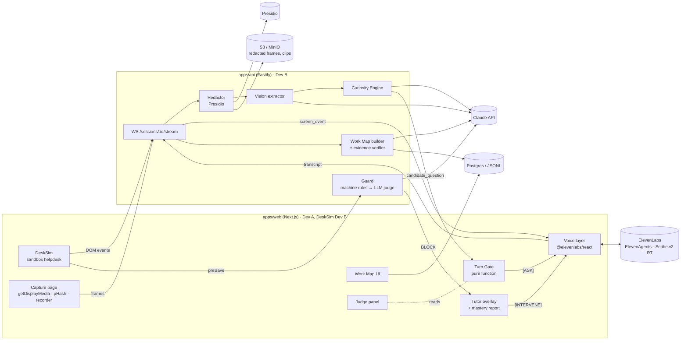
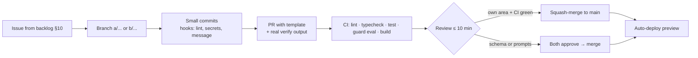

# Shadow: 24-hour implementation plan

**Team:** 2 developers · **Window:** 24 h · **Brief:** `file.pdf` (Hack-Nation × ElevenLabs, Challenge 01 "The AI Apprentice") · **Product rationale:** `docs/PRODUCT_PLAN.md` · as of 2026-10-03

> Read order: §1 (what wins) → §2 (scope) → §9 (your hours) → your component in §6 → `AGENTS.md`.

---

## 0. TL;DR

- **Build:** an apprentice that watches a senior support lead triage tickets in our sandbox helpdesk (DeskSim), asks *why* at real pauses, turns the session into an evidence-linked Work Map, and coaches a new hire, blocking a wrong refund before it is saved.
- **Stack:** TypeScript monorepo (pnpm + Turborepo). Next.js 16 web, Fastify 5 API with WebSockets, Zod contracts shared by both, ElevenAgents for voice, Claude (`claude-opus-5-5`, per-route effort) for vision and reasoning, Presidio (Docker) for redaction, Postgres + S3-compatible storage.
- **Split:** **Dev A** (you) owns the voice and every screen the user sees. **Dev B** owns DeskSim and everything behind the API. Contracts in `packages/schema` are frozen at H0:45; both of you build against fixtures, so neither waits on the other.
- **Gates:** H4 voice + one screen · H9 Capture · H14 Map · H19 Teach · **H20 feature freeze** · H21 deployed · H24 submitted.
- **Already done (scaffold, verified):** monorepo, CI, hooks, contracts, guardrail engine (9/9 catches, 0 false blocks on seed), Turn Gate logic (7 tests), API skeleton (guard, sessions, WS), typed Claude wrapper, vision extractor, agent prompts, seed tickets, AI-assistant rules.

---

## 1. Judge's lens: what wins

I read the brief as a judge would. Judges score **evidence they can see**, not claims. Every row below needs a visible moment in the demo.

### 1.1 Pass/fail requirements

| Requirement (brief) | What the judge sees | Where it's built |
| --- | --- | --- |
| ≥ 3 live questions, each at a natural pause, about something on screen; ≥ 1 guardrail | Judge panel: each question with its pause reason ("silence 1.8 s, idle 3.4 s"), the ticket it's about, and its slot (guardrail / reason) | §6.4, §6.5 |
| Debrief: ≥ 3 follow-ups not answered live + a teach-back the expert confirms | Coverage meter climbs; teach-back is read aloud; expert corrects one detail; "Confirmed at 07:42" badge | §6.7 |
| Every step and guardrail links to a screen moment and the expert's own words | Click any step → frame + clip replay + verbatim quote with timestamp | §6.6 |
| Tutor catches ≥ 1 wrong decision on an unseen case **before it is saved**, explains with the expert's reasoning | "Paused by Shadow" on the Refund button; tutor asks why; replays the expert's clip | §6.8 |

### 1.2 The five Apprentice Test questions (rehearse a one-line answer for each)

| Question | Our answer (say it in the pitch) | Proof on screen |
| --- | --- | --- |
| When to ask | "A deterministic Turn Gate: silence ≥ 1.5 s, no typing ≥ 3 s, screen still ≥ 2.5 s, a high-value gap, and a budget of ≤ 5 per 10 min. The LLM decides *how* to ask, never *when*." | Judge panel shows the gate's live state and why it's closed |
| What to ask | "Every decision opens slots (reason, guardrail, exception). We rank gaps by value × surprise, and drop anything the screen already answers." | Candidate list with scores; crossed-out "screen-answerable" items |
| When it has understood | "Coverage of required slots ≥ 90 %, no high-priority gaps left, then a teach-back the expert confirms, then it predicts two variants correctly." | Coverage meter, confirmation badge, prediction check |
| Whether the new hire learned | "Unseen tickets, predict-then-act, a guard on every save, and a mastery report: independent / assisted / missed per guardrail." | Mastery report |
| Trust | "Off the record by button, hotkey or voice; nothing is stored for that span. PII is redacted before storage and before any LLM sees it. The expert can delete any step before publishing." | Grey gap on the timeline; redacted frames |

### 1.3 Strong vs weak (from the brief) and how we land on the strong side

| Weak | Our guard against it |
| --- | --- |
| Interrupts mid-typing, generic questions | Turn Gate + `sendUserActivity()` on every keystroke; questions must name an on-screen ticket |
| Only the happy path | Seed has 4 guardrail tickets out of 4 expert tickets; debrief asks about unseen cases (fraud, legal, GDPR) |
| Summary written from the transcript afterwards | Spoken debrief with gap questions + confirmed teach-back; map built from evidence, not from a summary |
| Screen recording nobody watches | Clips are 10 s around each step, played only when the tutor needs them |
| Demo that stops at the demo | Moonshot slide + Copilot export shows the path to "people first, then agents" |

### 1.4 What else judges reward (and we deliberately show)

1. **Depth of ElevenLabs use:** both roles on ElevenAgents, Expressive Mode, Scribe v2 Realtime (inside the agent) for pause-aware listening, `skip_turn`, contextual updates, client tools (`replay_clip`), and a knowledge base built from the Work Map.
2. **It's live, not canned.** The judge can shout a curveball and the system copes. The guard eval and CI badge in the README prove the engineering is real.
3. **Honesty.** The judge panel shows vision events next to DeskSim's DOM ground truth. Admitting the vision accuracy (e.g. "94 % of decision events") earns more trust than hiding it.
4. **Calm UX.** The agent's state is always visible: listening / quiet / asking / off the record.

---

## 2. Scope for 24 hours

| Priority | Item |
| --- | --- |
| **Must** (gates) | DeskSim · voice side panel · screen capture + vision events · Turn Gate · Curiosity Engine · Work Map builder with evidence verifier · debrief + teach-back · Work Map UI with clip replay · tutor with pre-save guard (machine rules + LLM judge) · off the record · PII redaction of stored frames and transcript · judge debug panel · deployed HTTPS build · backup video |
| **Should** | Postgres adapter (else JSONL snapshot) · mastery report polish · predict-two-variants proof · Playwright e2e of the intercept |
| **Could** (only after H19 gate) | Copilot export + shadow mode on held-out tickets · German expert → English tutor · MCP tool server for the tutor |
| **Won't** | Real Zendesk/Intercom integrations · auth/multi-tenant · browser extension for arbitrary apps · fine-tuning · two-expert diff |

---

## 3. Architecture



### 3.1 Key decisions (ADRs in `docs/adr/`)

| # | Decision | Why | Rejected |
| --- | --- | --- | --- |
| 1 | All-TypeScript monorepo, Zod contracts shared | 2 people, 24 h: one language, compile-time contract checks across the wire | FastAPI backend (second language, schemas duplicated) |
| 2 | Fastify API separate from Next.js | WebSockets + long LLM calls need a long-lived server; Next route handlers on serverless can't hold a WS | Everything in Next.js |
| 3 | DeskSim, our own helpdesk | Fake data (no real PII), DOM ground truth to measure vision, and a real `preSave` hook so "before it is saved" is guaranteed | WebArena / third-party app (can't intercept saves) |
| 4 | WHEN is deterministic, HOW is LLM | Timing is where voice agents fail; a pure function is testable and explainable to judges | Letting the agent decide when to speak |
| 5 | Guard: machine rules first, LLM judge second | Instant and certain where rules are literal; the judge covers paraphrases ("used without my permission" vs "fraud") | LLM only (slow, uncertain) / rules only (misses unseen wording) |
| 6 | One model (`claude-opus-5-5`) with per-route effort; server-side `fallbacks: "default"` | Low effort on the newest model is usually better than a smaller model; one config to reason about; refusals fall back automatically | Mixed models from the start (switch only if measured latency forces it, see §14) |
| 7 | Presidio via official Docker images | Brief recommends it; no Python code to maintain | Hand-rolled regex redaction |
| 8 | Storage behind a `Store` port; in-memory now, Postgres adapter as Should | Unblocks H0; the port keeps routes unchanged when Postgres lands | Postgres as a blocker on day 1 |

---

## 4. Repository map

```
apps/
  web/                    Next.js 16 · Dev A (desk/ = Dev B)
    src/app/desk          DeskSim
    src/app/capture       expert session + judge panel
    src/app/map/[id]      Work Map
    src/app/teach         tutor + mastery report
    src/app/copilot       stretch
    src/app/api/eleven    signed-URL route (key stays server-side)
    src/lib/turnGate.ts   Turn Gate (pure, tested)
  api/                    Fastify 5 · Dev B
    src/routes            guard, sessions (+ WS), workmaps, tickets
    src/llm               structured() wrapper, vision, curiosity, workmap, judge
    src/privacy           off-record, Presidio client
    src/store             Store port + adapters
packages/
  schema/                 Zod contracts · BOTH approve changes
  guard/                  deterministic rule engine + eval
  prompts/                versioned LLM prompts + per-route effort
agents/                   ElevenAgents prompts + dashboard settings (config as code)
seed/                     demo tickets + reference guardrails (answer key, tests only)
infra/                    docker-compose: Postgres, MinIO, Presidio
docs/                     this plan, product plan, ADRs, demo script, prompt changelog
```

---

## 5. Contracts (frozen at H0:45)

All in `packages/schema/src`. Change only via the protocol in `AGENTS.md` §4.

| Contract | File | Used by |
| --- | --- | --- |
| `Ticket`, `Outcome` | `ticket.ts` | DeskSim, guard, seed |
| `DeskEvent` (DOM ground truth) | `events.ts` | DeskSim → API |
| `VisionResult` (incl. `screenAnswers`, `unreadable`) | `events.ts` | vision extractor |
| `ScreenEvent`, `TranscriptSegment` | `events.ts` | API ↔ web |
| `WorkMap`, `Step`, `Guardrail`, `MachineRule`, `OpenQuestion` (+ evidence refinements) | `workmap.ts` | builder, UI, tutor, guard |
| `PendingAction`, `GuardVerdict`, `MasteryReport` | `guard.ts` | DeskSim, guard, teach |
| `ClientMessage`, `ServerMessage`, `CandidateQuestion`, `PROTOCOL_VERSION` | `protocol.ts` | WebSocket |

**Voice control protocol** (web → agent via `sendUserMessage`, hidden from the UI transcript): `[ASK]`, `[DEBRIEF]`, `[TEACHBACK]`, `[PREDICT]`, `[INTERVENE]`. Screen context goes via `sendContextualUpdate("[SCREEN mm:ss] …")`, which never triggers a reply. Full table: `agents/README.md`.

**Fixtures first:** at H0:45 each dev adds `fixtures/*.json` for the messages they *produce* (a recorded `ScreenEvent` stream, a sample `WorkMap`, a `GuardVerdict`), validated by a test against the schema. The other dev builds against these until the real thing is merged.

---

## 6. Component specs

Each spec ends with **Done when**: the acceptance test for the PR.

### 6.1 DeskSim (Dev B · H0:45–4)

- Routes: `/desk` (queue) and `/desk/[ticketId]` (detail). Detail shows customer (name, plan, VIP), amount, tags, `knownBugId`, body, and an action bar: Reply, Refund (amount), Hold/request info, Escalate (Tier 2 / Engineering), Handoff (Security / Legal / Billing disputes), Close.
- Tickets come from `GET /tickets?set=expert|new_hire|held_out`. **The API strips `label` before sending.** A test asserts no label ever leaves the API.
- Every interaction emits a `DeskEvent` over the session WebSocket. Keystrokes emit throttled `input_activity` (max 1 per 500 ms).
- Every action goes through `await guard.preSave(action)`. In Capture mode it's logged only; in Teach mode a `BLOCK` keeps the action uncommitted and shows "Paused by Shadow".
- Elements showing personal data carry `data-pii` for client-side blur before snapshotting.
- Visual style: plain, high-contrast, large type. The vision model reads it more reliably and judges can read it on a projector.

**Done when:** an expert can triage T1–T4 end to end; DeskEvents appear in the API log; `preSave` returns BLOCK for N1/refund with fallback rules on.

### 6.2 Voice layer (Dev A · H0:45–4)

- `GET /api/eleven/signed-url?agent=interviewer|tutor` (scaffolded) → `useConversation().startSession({ signedUrl })`. Pass `expert_name` / `learner_name` as dynamic variables (verify the exact option name in `node_modules/@elevenlabs/react` types before use).
- `useVoice()` hook wraps the SDK and exposes: `status`, `mode` (speaking / listening), `transcript[]`, `sendControl(prefix, payload)`, `sendScreen(event)`, `markActivity()`.
  - `sendScreen` coalesces events: at most one `sendContextualUpdate` per 2 s, newest wins.
  - `markActivity` calls `sendUserActivity()` on DeskSim input, so the agent holds its turn while the expert types.
  - Control messages (`[ASK]…`) are filtered out of the visible transcript.
- Transcript segments go to the API (`transcript` message) with timestamps relative to session start; the agent's own lines are tagged `speaker: "agent"`.
- Side panel: agent state chip, live transcript, question counter (n / 5), off-the-record toggle.

**Done when:** the expert talks to the agent, DeskSim events reach it as context, and it answers "what ticket am I on?" correctly when asked directly.

### 6.3 Screen pipeline (A: capture H4–6 · B: server H4–9)

**Browser (A):** `getDisplayMedia({ video: { frameRate: 5 } })` → hidden video → every 1.5 s draw to a 1280-px canvas → blur `data-pii` rects (when the shared tab is DeskSim) → compute a perceptual hash → send `frame` only if the Hamming distance ≥ threshold (tune at H6; start with 6/64). In parallel, `MediaRecorder` records the whole session (webm, 1 Mbps) for clips.

**Server (B), per frame:**
1. Drop if off the record.
2. Presidio image redactor → redacted JPEG → S3 `frames/<session>/<frameId>.jpg`. **Unredacted frames are never stored.**
3. `extractEvents(prev, cur, recent)` (`apps/api/src/llm/vision.ts`, done) → `VisionResult`.
4. Each event → `ScreenEvent` → WS `screen_event`, and recorded for the map.
5. `unreadable: true` → no events; counted in the judge panel.
6. Keep the last 5 `screenAnswers` for the Curiosity Engine.

Concurrency: at most one vision call in flight per session; if a frame arrives while one is running, keep only the newest pending frame.

**Done when:** on a recorded run, p90 frame→event latency ≤ 3 s, and decision events match DOM ground truth on ≥ 90 % of T1–T4 actions (the judge panel shows both).

### 6.4 Turn Gate (Dev A · H6–9)

- Logic is done and tested: `apps/web/src/lib/turnGate.ts`. Wire its signals:
  - `lastUserSpeechMs`: from user transcript/VAD events in the SDK's `onMessage` (check what the installed version emits; tentative user transcripts work).
  - `lastInputActivityMs`: DeskSim `input_activity`.
  - `lastScreenChangeMs`: pHash changed.
  - `agentSpeaking`: `isSpeaking`.
  - `candidate`: latest `candidate_question` from the API.
- Evaluate every 250 ms. On open: `sendControl("[ASK]", question.text)`, send `question_asked`, clear the candidate.
- Judge panel: all five signals with timers, the current gate decision + reason, questions asked with their pause metrics.

**Done when:** on a 10-minute session the log shows 3–5 questions, all opened by the gate, and zero agent speech while the expert is speaking or typing.

### 6.5 Curiosity Engine (Dev B · H6–9)

- **Gap Ledger** per session. A decision event (DOM `action_committed` or vision `decisionCandidate`) opens a step hypothesis with slots `reason`, `guardrail` (required), `exception`, `escalation_contact` (for handoffs).
- Slots are filled when the expert's answer to a question about that step arrives. Matching is by `aboutTicketId` plus timing (answer within 30 s of the ask); no LLM needed.
- **Priority** = `slotWeight × surprise × (1 − screenAnswerable) × recency`
  - `slotWeight`: guardrail 1.0 · reason 0.8 · exception 0.6
  - `surprise`: 1.0 when the outcome differs from the naive one (money mentioned but no refund; handoff instead of reply), else 0.5
  - `screenAnswerable`: 1 if the slot's answer is literally in `screenAnswers` (string match first; the LLM prompt also forbids it)
  - `recency`: linear decay to 0 over 60 s; decayed gaps go to the debrief queue
- Top gap ≥ 0.6 → the `curiosity` route phrases one question (≤ 20 words) naming the ticket → `candidate_question`.
- Unseen-case probes for the debrief: at task end, the curiosity route proposes ≤ 3 "cases I haven't seen" questions from the outcome list minus outcomes observed (e.g. no legal handoff seen → "What do you do when a customer mentions a lawyer or GDPR?"). **This is how the N1 fraud rule gets learned** (§6.8).

**Done when:** the fixture session produces ≥ 3 candidates with ≥ 1 guardrail slot, and none asks about a fact in `screenAnswers` (unit test with a fixture).

### 6.6 Work Map builder + evidence verifier (Dev B · H9–13)

- Input: events (with frameIds), transcript segments (ids, times), answered questions, off-record spans.
- `workMapBuilder` route (effort high, streaming) → `WorkMap` JSON via `structured()`.
- **Deterministic evidence verifier, after the model (the anti-hallucination core):**
  1. Every `quote.text` must be a verbatim substring of its `segmentId`'s text (normalize whitespace and case only).
  2. Every `frameId` must exist in the session; every `segmentId` must exist and be `speaker: "expert"`.
  3. No step or guardrail may cite a time inside an off-record span (schema refinement already enforces this).
  4. Every `guardrailIds` reference resolves (schema refinement, done).
  5. `machineRule` phrases in `bodyMatchesAny` must appear in the cited quote, otherwise the rule is dropped (the guardrail stays, and the LLM judge covers it).
- On violations: one repair pass with the violation list → re-verify → anything still failing is **removed and turned into an open question**. Never published unverified.
- `GET /workmaps/:id`, `PATCH /workmaps/:id` (expert edits and deletes), `POST /workmaps/:id/publish`, `GET /workmaps/:id/markdown` (tutor knowledge base).

**Done when:** on the rehearsal session, 100 % of published steps and guardrails pass the verifier, and a unit test proves that a fabricated quote is rejected.

### 6.7 Debrief + teach-back (A: UI H9–12 · B: logic H11–14)

1. Expert clicks **End task** → API builds a draft map → returns `openQuestions` (gaps + unseen-case probes, priority-sorted).
2. `[DEBRIEF] {questions}` → the agent asks them in order. After each answer, `POST /sessions/:id/debrief/answer` → incremental rebuild → new coverage.
3. **Done rule:** coverage ≥ 0.9 AND no open question ≥ 0.7 AND ≥ 3 debrief questions asked. Hard cap: 8 questions or 5 minutes.
4. `teachBack` route → text ≤ 140 words → `[TEACHBACK] text`. The expert confirms or corrects; a correction triggers a patch + a one-sentence re-check (max 2 loops). Confirmation stores `teachBackConfirmedAtMs`.
5. **Prediction proof:** the API generates 2 variant tickets from the map (e.g. T3 without the chargeback tag); Shadow states its prediction; the expert says right or wrong. Logged on the map.

**Done when:** the judge sees ≥ 3 debrief questions not asked live, the teach-back, a correction, and the confirmed badge.

### 6.8 Tutor + pre-save intercept (A: H14–18 · B: H14–17)

- Publish the map → its Markdown goes into the Tutor agent's knowledge base. Upload it via the dashboard for the demo; automating that through the API is Could.
- **Teach mode on DeskSim:** tickets N1, N2 (+ held-out ones). At judgment steps the tutor gets `[PREDICT] {stepId, ticketId}`.
- **Guard on every save (B):**
  1. Machine rules from the *published* map (`@shadow/guard`, instant).
  2. If ALLOW and the action is consequential (refund, reply, close): `guardJudge` route with the map's guardrails, 2.5 s timeout. A timeout returns ALLOW with `source: "timeout_allow"`, and it's logged and shown in the judge panel. It is never silent.
  3. Verdict to the browser. DeskSim shows "Checking with Shadow…" while this runs.
- **On BLOCK (A):** keep the action uncommitted → `[INTERVENE] {ruleIds, quote, frameId}` → the tutor asks "Maya would stop here. Why do you think?" → the learner answers → `replay_clip(frameId)` plays the expert's clip → the learner picks the expected outcome → save succeeds.
- **The judged case, N1** ("refund €180" + "card used without my permission"): the expert never saw it. The fraud guardrail comes from the debrief's unseen-case probe ("What if a customer says their card was used without permission?" → expert: "Never refund that, it goes to Security first"). Literal rules may miss the wording, and the LLM judge covers paraphrases. **Rehearse this exact path 3 times.**
- **Mastery report (A UI, B compute):** per step/guardrail: independent (right first time), assisted (right after a PREDICT correction or intervention), missed; "practice next" = missed + assisted.

**Done when:** in 3/3 rehearsals the N1 wrong refund is held before save and explained with the expert's own quote and clip.

### 6.9 Trust and privacy (A: UI H6–8 · B: server H6–9)

| Control | Implementation |
| --- | --- |
| Off the record | Button, hotkey `Alt+O`, or the phrase "off the record" in the transcript (and "back on the record"). The browser stops sending frames and transcript; the API drops anything in the span (done, `privacy/offRecord.ts`); the timeline shows a grey gap; the agent acknowledges once and stays silent. |
| Redaction | Frames: client blur of `data-pii` + Presidio image redactor before storage. Text: Presidio analyzer + anonymizer on transcript segments before storage and before any LLM route. Vision sees only DeskSim with fake data. |
| Expert control | Before publish, the expert can delete any step, quote or clip (`PATCH`). |
| Secrets | API keys only on servers; signed URL for the browser; logger redacts auth headers; secret scan in hooks and CI. |
| Retention | Clips only around steps; the full recording is deleted after the map is published (Should). |

### 6.10 Copilot export (stretch, B · only after the H19 gate)

`GET /workmaps/:id/export?format=agent` → system prompt + `rules.json`. The `/copilot` page runs the guard + judge over the 10 held-out tickets and shows each decision, the cited rule, "handed to human" for judgment calls, and agreement with the seed labels. This is the bridge to the moonshot slide.

### 6.11 Persistence (B)

Must: in-memory `Store` + an append-only JSONL snapshot per session in `infra/data/` (survives an API restart during the demo). Should: Drizzle + Postgres adapter behind the same `Store` interface.

### 6.12 Observability and robustness

- Every log line carries `sessionId`; every LLM call logs `route`, `version`, latency, and stop reason.
- Judge panel (A): gate signals, candidates with scores, vision vs DOM agreement, LLM latencies, guard verdict sources.
- Rate limiting on LLM-backed routes (`@fastify/rate-limit`), body limits (done), CORS to `WEB_ORIGIN` (done).
- WebSocket reconnects with backoff in the browser; the API keeps session state across reconnects.

### 6.13 Product-side hallucination controls (summary)

The coding-assistant rules are in `AGENTS.md`. Inside the product, the same principle applies:

1. All LLM output passes a Zod schema (`structured()`), or the call fails with a typed error.
2. The evidence verifier (§6.6) checks quotes, frames and times deterministically; unverifiable content becomes an open question.
3. The guard is deterministic first; the LLM judge can only cite existing guardrails, never create new ones.
4. The tutor's prompt says: if the map doesn't cover it, say so and refer to a senior colleague.
5. The vision prompt reports only what's visible and flags `unreadable` instead of guessing.

---

## 7. Collaboration pipeline (two developers)

### 7.1 Ownership

| Area | Owner | Reviewer |
| --- | --- | --- |
| `apps/web` (except desk), `agents/` | Dev A | Dev B |
| `apps/web/src/app/desk`, `apps/api`, `packages/guard`, `packages/prompts`, `seed/` | Dev B | Dev A |
| `packages/schema` | both | both must approve |
| `docs/`, demo script, deck | Dev A | Dev B |

Ownership is in `.github/CODEOWNERS`. Owning an area means you merge it; the other person reviews.

### 7.2 Flow



- **Trunk-based.** `main` is always demoable. Branches live < 3 hours. Rebase on `main` before opening a PR.
- **Review SLA: 10 minutes.** If the other dev is heads-down, self-merge is allowed in your own area when CI is green. Leave a "post-merge review" label; they look at it at the next checkpoint.
- **No shared files in parallel.** If both of you must touch one file, the second person waits for the first PR to merge. Exception: schema, which is serialized through §4 of `AGENTS.md`.
- **Checkpoints** at H4, H9, H14, H19 (15 min each): merge everything, run the gate demo together, re-plan. If a gate fails, cut scope per §2. Don't slip the clock.
- **Hand-offs** happen through fixtures and contracts, never "I'll tell you the shape later".

### 7.3 Environment and secrets

- One shared vault entry (1Password/Bitwarden) holds `.env` values. Never in chat, never in git.
- Each dev uses their own ElevenLabs and Anthropic keys locally if possible; production keys only in Vercel/Railway env settings.
- Both dev machines: Node 22, pnpm 12, Docker. `pnpm install && pnpm verify` must pass before H0:45.

### 7.4 Deployment

| Piece | Where | How |
| --- | --- | --- |
| Web | Vercel | Git integration; preview per PR; production from `main` |
| API | Railway (or Fly.io) | `apps/api/Dockerfile`; WebSockets supported; health check `/health` |
| Postgres / storage | Railway Postgres; Cloudflare R2 or Supabase Storage (S3 API) | env vars only; same `Store`/S3 interfaces |
| Presidio | Railway services from the official images | three small services |

Deploy production at **H12** once (smoke test), then again after the freeze. HTTPS is mandatory: screen capture and the mic need a secure context.

---

## 8. Testing and validation

| Layer | What | Tool | Owner |
| --- | --- | --- | --- |
| Unit | Turn Gate, guard engine, priority scoring, evidence verifier, off-record | Vitest | owner of the code |
| Contract | Fixtures parse against schemas; WS messages validated both ends | Vitest + Zod | both |
| API | Routes via `app.inject` (done: health, guard, sessions) | Vitest | B |
| Eval: guard | Seed catch rate ≥ 90 %, 0 false blocks (done, in CI) | `pnpm eval:guard` | B |
| Eval: captured map | After each rehearsal: guard (rules + judge) on N1, N2, H1–H10 using the *captured* map | `pnpm eval:tutor` (to build, H17) | B |
| Eval: questions | 2 people rate each live question: on-screen? at a pause? answerable from the screen? | sheet in `eval/` | both |
| E2E | Playwright: open N1 in teach mode → click Refund → assert "Paused by Shadow" and no commit | Playwright | A (H19–20) |
| Rehearsal | Full run ×3 with timings | `docs/demo-script.md` | both |

### Requirement traceability

| Brief requirement | Test that proves it |
| --- | --- |
| ≥ 3 live questions at pauses, ≥ 1 guardrail | Session log assertion in rehearsal + Turn Gate unit tests |
| ≥ 3 debrief questions not answered live | Debrief log: questions ∩ live questions = ∅ |
| Teach-back confirmed | `teachBackConfirmedAtMs` non-null |
| Every step/guardrail links to frame + words | Evidence verifier + `WorkMap` schema tests |
| Unseen case caught before save | Playwright e2e + `eval:tutor` on N1 |
| Off the record + PII | Unit tests (off-record) + manual check of stored frames |

---

## 9. 24-hour timeline

H0 = kickoff. Dev A = you (voice and experience). Dev B = teammate (DeskSim and brain).

```mermaid
gantt
  dateFormat  HH:mm
  axisFormat  H%H
  title Shadow · 24 h

  section Both
  Setup + contract freeze          :crit, s0, 00:00, 45m
  Checkpoint H4                    :milestone, m1, 04:00, 0m
  Checkpoint H9 (Capture)          :milestone, m2, 09:00, 0m
  Checkpoint H14 (Map)             :milestone, m3, 14:00, 0m
  Checkpoint H19 (Teach)           :milestone, m4, 19:00, 0m
  Freeze, e2e, deploy, backup video:crit, f1, 19:15, 105m
  Rehearse x3, deck, submit        :crit, f2, 21:00, 3h

  section Dev A
  Voice layer + side panel         :a1, 00:45, 195m
  Capture, pHash, recorder         :a2, 04:00, 2h
  Turn Gate wiring + judge panel   :a3, 06:00, 3h
  Off-record UI                    :a3b, 07:30, 90m
  Debrief UI + teach-back flow     :a4, 09:00, 3h
  Work Map UI + clip replay        :a5, 12:00, 2h
  Rest                             :a6, 14:00, 75m
  Tutor overlay, PREDICT, INTERVENE:a7, 15:15, 2h
  Mastery report UI                :a8, 17:15, 105m

  section Dev B
  DeskSim + preSave + DOM events   :b1, 00:45, 195m
  Frame pipeline + redaction       :b2, 04:00, 3h
  Curiosity Engine                 :b3, 06:00, 3h
  Work Map builder + verifier      :b4, 09:00, 4h
  Debrief logic + teach-back       :b5, 11:00, 3h
  Guard: map rules + LLM judge     :b6, 14:00, 2h
  Rest                             :b7, 16:00, 75m
  Mastery compute + eval:tutor     :b8, 17:15, 105m
```



| Window | Dev A | Dev B | Exit check |
| --- | --- | --- | --- |
| H0:00–0:45 | Keys, ElevenLabs agents from `agents/*.md`, `pnpm verify` | Keys, `pnpm infra:up`, `pnpm verify` | Both green; contracts reviewed together; fixtures agreed |
| H0:45–4 | A1 voice layer, A2 side panel, A3 contextual updates | B1 DeskSim, B2 DOM events + preSave, B3 tickets API (labels stripped) | **Gate 1:** expert works T3, agent knows what's on screen |
| H4–9 | A4 capture + pHash + recorder, A5 Turn Gate wiring, A6 judge panel, A7 off-record UI | B4 frame pipeline + Presidio, B5 vision → events, B6 Curiosity Engine, B7 transcript ingest + redaction | **Gate 2 (Capture):** 3–5 questions at pauses, ≥ 1 guardrail, 0 interruptions |
| H9–14 | A8 debrief UI, A9 teach-back loop, A10 Work Map UI + clips | B8 builder + verifier, B9 debrief answer + coverage, B10 unseen-case probes, B11 JSONL persistence, deploy smoke (H12) | **Gate 3 (Map):** map 100 % verified, ≥ 3 debrief Qs, teach-back confirmed |
| H14–19 | rest 75 min · A11 tutor overlay + PREDICT/INTERVENE + replay · A12 mastery UI | B12 guard on published map + judge · rest 75 min · B13 mastery compute · B14 `eval:tutor` | **Gate 4 (Teach):** N1 held before save, explained with the expert's quote + clip |
| H19–21 | A13 Playwright e2e, polish UX copy | B15 deploy prod, Postgres adapter if time, Copilot export only if all gates passed early | Prod URL works over HTTPS on the demo laptop |
| H21–24 | Rehearsal ×3 (A plays expert), deck, README | Rehearsal ×3 (B plays new hire), backup video, submission | Submitted with 30 min buffer |

**If a gate fails:** stop new work, both swarm the failing gate for at most 60 minutes, then cut from Should/Could. The Must list never slips past H20.

---

## 10. Backlog (create as GitHub issues: `scripts/create-issues.sh`)

| ID | Title | Owner | Window | Depends | Done when |
| --- | --- | --- | --- | --- | --- |
| A1 | `useVoice` hook: signed URL, start/stop, transcript, sendControl, sendScreen (coalesced), markActivity | A | H0:45–2:30 | — | Agent converses; control msgs hidden |
| A2 | Capture side panel: state chip, transcript, counter, off-record toggle | A | H2:30–3:30 | A1 | Visible states match SDK mode |
| A3 | DeskSim events → `sendContextualUpdate` + `sendUserActivity` | A | H3:30–4 | A1, B2 | Agent names the open ticket when asked |
| A4 | Screen capture: snapshots, PII blur, pHash, WS frames, MediaRecorder | A | H4–6 | — | Frames reach API only on change |
| A5 | Turn Gate wiring (signals, 250 ms loop, `[ASK]`) | A | H6–8 | A1, B6 | 10-min run: 3–5 Qs, 0 interruptions |
| A6 | Judge panel | A | H8–9 | A5 | Shows gate reason, candidates, vision vs DOM |
| A7 | Off-record UI (button, Alt+O, phrase detection) | A | H7:30–9 | A1 | Grey gap; agent silent in span |
| A8 | Debrief UI: End task, open questions, coverage meter | A | H9–11 | B9 | Coverage updates per answer |
| A9 | Teach-back loop + confirm/correct + prediction proof | A | H11–12 | A8, B9 | Confirmed badge stored |
| A10 | Work Map page: timeline, frames, quotes, guardrails, clip replay | A | H12–14 | B8 | Every step clickable to clip + quote |
| A11 | Tutor overlay: PREDICT, INTERVENE, `replay_clip`, "Paused by Shadow" | A | H15:15–17:15 | B12 | N1 path works 3/3 |
| A12 | Mastery report UI | A | H17:15–19 | B13 | Shows independent/assisted/missed |
| A13 | Playwright e2e of the intercept | A | H19:15–20:30 | A11 | CI-runnable test passes |
| B1 | DeskSim queue + detail + action bar | B | H0:45–2:30 | — | Triage T1–T4 by mouse |
| B2 | DOM `DeskEvent` emitter + throttled `input_activity` + `preSave` hook | B | H2:30–3:30 | B1 | Events in API log |
| B3 | `GET /tickets?set=` with labels stripped + test | B | H3:30–4 | — | Test asserts no `label` in response |
| B4 | Presidio client + frame redaction + S3 upload | B | H4–6 | infra | Stored frames redacted |
| B5 | Frame queue (1 in flight, newest wins) → vision → `screen_event` | B | H5–7 | B4 | p90 ≤ 3 s on recording |
| B6 | Curiosity Engine: Gap Ledger, scoring, phrasing, `candidate_question` | B | H6–9 | B5 | Fixture test: no screen-answerable Qs |
| B7 | Transcript ingest + Presidio text redaction + off-record drop | B | H7–9 | — | Unit tests |
| B8 | Work Map builder + evidence verifier + repair pass | B | H9–13 | B5, B7 | Fabricated-quote test rejects |
| B9 | Debrief: open questions, answer → coverage, done rule, teach-back text | B | H11–14 | B8 | Done rule unit-tested |
| B10 | Unseen-case probes | B | H12–13 | B6 | Debrief asks fraud/legal probe |
| B11 | JSONL session snapshot + reload on boot | B | H13–14 | — | API restart keeps session |
| B12 | Guard on published map + LLM judge (2.5 s timeout) + verdict sources | B | H14–16 | B8 | N1 BLOCK from captured map |
| B13 | Mastery computation | B | H17:15–18:15 | B12 | Report JSON matches schema |
| B14 | `eval:tutor` on captured map | B | H18:15–19 | B12 | Scorecard printed |
| B15 | Prod deploy (Vercel + Railway) + smoke | B | H12, H19:15 | — | HTTPS URL works |
| S1 | Copilot export + /copilot page (stretch) | B | after H19 if gates early | B12 | Agreement % shown |
| D1 | Demo script, deck, README polish | A | H21–24 | — | 3 clean rehearsals |

---

## 11. References (verified on 2026-10-03)

- Brief: `file.pdf` in repo root.
- ElevenLabs React SDK: https://elevenlabs.io/docs/eleven-agents/libraries/react (`useConversation`, `sendContextualUpdate`, `sendUserMessage`, `sendUserActivity`, signed URL endpoint).
- `skip_turn` system tool: https://elevenlabs.io/docs/eleven-agents/customization/tools/system-tools/skip-turn
- Client tools: https://elevenlabs.io/docs/eleven-agents/customization/tools/client-tools
- Scribe v2 Realtime: https://elevenlabs.io/blog/introducing-scribe-v2-realtime
- Claude structured outputs (TypeScript): `client.beta.messages.parse` + `betaZodOutputFormat`; types verified in `node_modules/@anthropic-ai/sdk` v0.131.
- Presidio: https://github.com/microsoft/presidio (official Docker images in `infra/docker-compose.yml`).

---

## 12. Demo plan

Full script with lines and timings: `docs/demo-script.md`. Shape (≈ 7 min live + 1 min pitch):

1. **Problem (30 s):** Maya, 9 years; Jonas, week one.
2. **Capture (2:30):** Maya triages T1–T4 while thinking aloud. 3–4 questions arrive at pauses. One goes off the record.
3. **Map (2:00):** End task → 3 debrief questions incl. the unseen-case probe → teach-back → Maya corrects one detail → confirmed → click through the Work Map.
4. **Teach (2:00):** Jonas opens N1 (never shown) → clicks Refund → "Paused by Shadow" → "Maya would stop here. Why do you think?" → clip replay → routes to Security → mastery report.
5. **Moonshot (1:00):** "People first, then agents": the same Work Map governs an AI triage agent (Copilot export if built).

**Fallbacks:** phone hotspot; backup video; a pre-recorded session that can be loaded if live capture fails (labelled as such if used: never pass it off as live).

---

## 13. Pre-demo checklist

- [ ] Prod URLs load over HTTPS on the demo laptop; mic + screen permissions granted in the demo browser profile
- [ ] `DEMO_FALLBACK_RULES=0` in production (the tutor must use the captured map)
- [ ] ElevenLabs agents: prompts match `agents/*.md`; Tutor KB holds the *new* map
- [ ] Judge panel visible on a second screen
- [ ] Backup video on the laptop and in the cloud
- [ ] Volume, external mic, quiet corner tested

---

## 14. Risks

| Risk | L | I | Mitigation |
| --- | --- | --- | --- |
| Agent speaks at the wrong time | H | H | Deterministic gate, `skip_turn`, `sendUserActivity` while typing; tuned in 3 rehearsals |
| Vision latency with Opus at low effort is too high | M | M | Measure at H7. Questions wait for pauses anyway; DOM events give timing. If p90 > 3 s, the team may decide to move only the vision route to a faster model; that's your call, logged as an ADR |
| N1 wording not caught by literal rules | M | H | LLM judge layer + unseen-case probe + 3 rehearsals + `eval:tutor` |
| Work Map hallucination | M | H | Evidence verifier; unverifiable → open question |
| Tired-team mistakes after H16 | H | M | Staggered rest blocks; freeze at H20; checklists |
| Venue network | M | H | Hotspot; backup video |
| Merge conflicts | M | M | Ownership map, small PRs, schema serialized |
| Key leak | L | H | Hooks + CI secret scan; keys only server-side |
